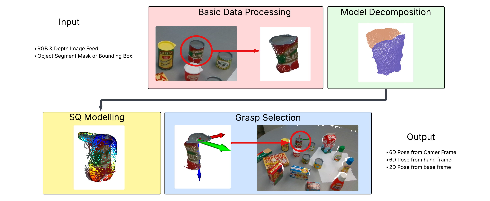
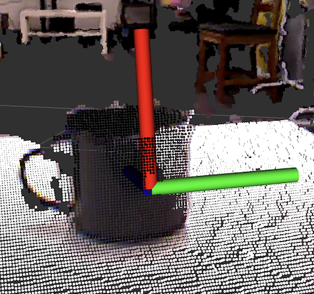
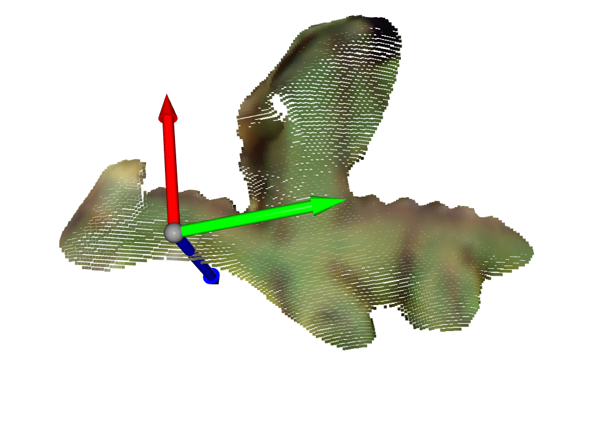
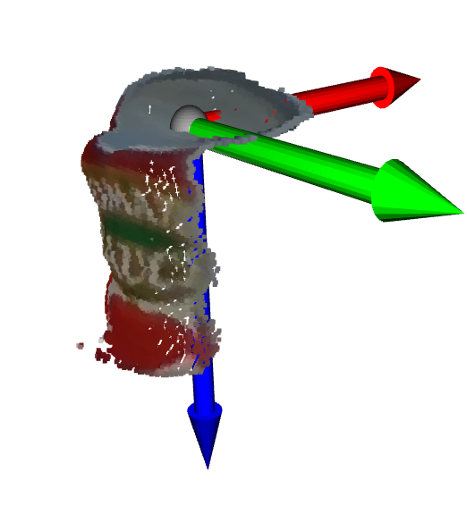

# Efficient Grasp using Superquadrics for Human Service Robots
### Jayden Kanbour

### Thesis Abstract
To serve their purpose, human service robots need a grasp solution that enables them
to reliably and quickly perceive and interact with objects in their environment, while
adhering to the constraints of their hardware and software. In recent years, deep
learning-based grasping solutions have taken the spotlight for their broad applicability
and high accuracy. However, to achieve this, they required high computational costs,
long training times, and a reliance on large annotated datasets. In contrast, geometric
approaches such as superquadrics offer lightweight representations but struggle with
partial views, occlusion, and complex object geometries. In light of recent research,
this thesis presents a three-stage pipeline that integrates base component identification,
superquadric fitting, and geometric grasp selection to generate efficient and reliable 6D
grasp poses from a single segmented depth image. The system does not require prior
object models, training data, or multi-view reconstruction, and is designed for seamless
integration into existing robotic perception pipelines. Evaluation demonstrates that
the proposed method achieves significantly higher computational efficiency than state-
of-the-art learning-based approaches, with a runtime of 0.018 seconds and the lowest
memory usage among all tested systems. Accuracy tests using the Toyota HSRb show
competitive grasp success rates in isolated and cluttered scenes, though performance
decreases under heavy occlusion due to single-view limitations. Overall, the results
highlight the potential of adaptive superquadric-based modelling as a fast and resource-
efficient alternative to deep learning for robotic grasping, particularly for real-time
operation on hardware-constrained service robots.

 
 
 
 

# Code

## This repository contains the following:
```shell
Base code in python
    -src
        -base code
            -pointCloudData.py.   # filters the target object from its environment and decomposes it into its base components 
            -superquadric.py.     # fits superquadric models to each base component from pointCloudData
            -grasps.py            # finds the optimal superquadric and 6D pose on its surface to service a grasp
    -src
        -ros package              # a rospackage to service the above pipeline
    -demo
        -data 
        -demp.py                  #demo code
```

## Running Demo
```shell
    $ git clone 
    $ cd 
    $ pip install -r requirements.txt
    $ cd demo 
    $ python3 demo.py
```
## Integrating Ros Package


